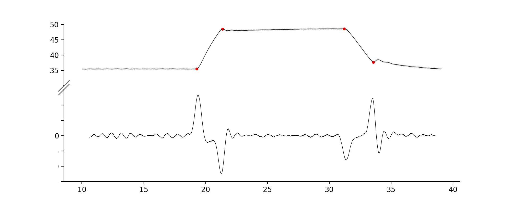
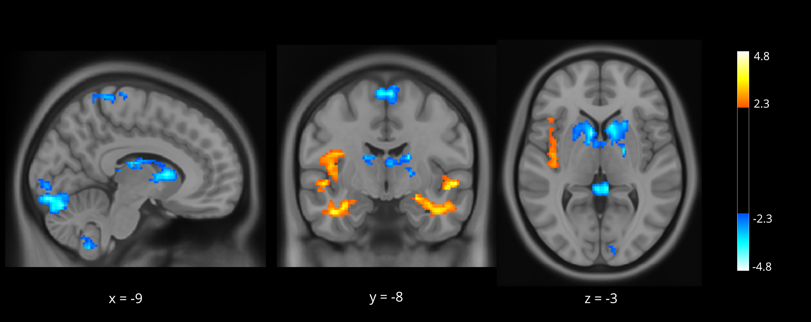

## lab manual addendum
> some useful computational tools  
> email: <griegner@ucsd.edu>

## table of contents

### neuroimaging analysis
- [download python](#download-python)
- [creating timing files from heat plateaus](#creating-timing-files-from-heat-plateaus)
- [brain extraction using ANTs](#brain-extraction-using-ANTs)
- [brain extraction using deepbrain](#brain-extraction-using-deepbrain)
- [statistical map plotting using nilearn](#statistical-map-plotting-using-nilearn)
- [running commands remotely with x11 forwarding](#running-commands-remotely-with-x11-forwarding)

### pain testing
- [thermal cutaneous stimulator](#thermal-cutaneous-stimulator)

### other learning resources
- [programming](#programming)
- [version control](#version-control)
- [statistics](#statistics)
- [neuroimaging](#neuroimaging)

-----
## neuroimaging analysis

### download python

- install [anaconda](https://www.anaconda.com/download/): best to download the command line installer
- note: during installation select *yes* to `$ do you wish the installer to initialize conda init? [yes|no]`
- note: on mac 10.14+ with zsh as the default shell, run `$ source ~/anaconda3/bin/activate; conda init zsh`

### creating timing files from heat plateaus

- this script ([stim_evs.py](https://github.com/griegner/stim_evs/blob/master/stim_evs.py)) finds local maxima/minima of the smoothed second derivative timeseries

- to run: `$ python <path to stim_evs.py>`

### brain extraction using ANTs

- it's probably best to install [ANTs](https://github.com/ANTsX/ANTs) with [neurodocker](https://github.com/ReproNim/neurodocker); otherwise, here are the steps to compile it

1. install [homebrew](https://brew.sh/)

2. install [Xcode](https://apps.apple.com/us/app/xcode/id497799835?mt=12)

3. `$ brew install git; brew install cmake`

4. might need to use `$ sudo` for the steps below
- `$ mkdir /opt/ANTs`
- add [installANTs.sh](https://github.com/cookpa/antsInstallExample/blob/master/installANTs.sh) to this directory
- to run: `$ sh /opt/ANTs/installANTs.sh`

5. [post-installation instructions](https://github.com/ANTsX/ANTs/wiki/Compiling-ANTs-on-Linux-and-Mac-OS)
- add to your shell initialization file: ex .zshrc file for zsh shell 
- `export ANTSPATH=/opt/ANTs/install/bin/; export PATH=${ANTSPATH}:$PATH`

6. follow [these](https://dpaniukov.github.io/2016/06/06/brain-extraction-with-ants.html) steps for brain extraction

### brain extraction using deepbrain

- follow [these](https://github.com/iitzco/deepbrain) steps for *easy, fast, and accurate* brain extraction

### statistical map plotting using nilearn

- thresholded z-statistic maps overlaid on mni standard template

 

1. install [nilearn](https://nilearn.github.io/introduction.html#python-for-neuroimaging-a-quick-start): `$ pip install -U --user nilearn`

2. fsl: creating the *statistical map image*
- `$ cd` to the thresh_zstat files of interest: these are *feat* nifti outputs
- `$ fslmaths thresh_zstat1.nii.gz -sub thresh_zstat2.nii.gz <name it>`
- note: this command subtracts deactivation (zstat2) from activation (zstat1)
- note: the output nifti file contains positive and negative z-values beyond the threshold set in *feat*

3. choosing an *mni anatomical image*
- use a background image generated by fsl or download a high-resolution 0.5mm mni image [here](http://nist.mni.mcgill.ca/?page_id=714) 
- recommended: *ICBM 2009b nonlinear symmetric 0.5x0.5x0.5mm nifti* 

4. *nilearn* documentation: [plot_stat_map](https://nilearn.github.io/modules/generated/nilearn.plotting.plot_stat_map.html#nilearn.plotting.plot_stat_map),
[view_img](https://nilearn.github.io/modules/generated/nilearn.plotting.view_img.html#nilearn.plotting.view_img)

5. *python script*: [plot_stat_map.py](https://github.com/griegner/plot_stat_map/blob/master/plot_stat_map.py)
- uses the nilearn package to save png files for every slice in the x y z directions
- to run: `$ python <path to plot_stat_map.py>`
- view the *fsl feat* report.html file:
- ex: 
- enter lower `vmin` (2.3) bound and upper `vmax` (3.8) bound for colormap
- select stats and background nifti files, then name output `directory/file`

### running commands remotely with x11 forwarding

- this enables running a command remotely, ex `$ fsl`, using the remote computer's *storage, cpu, and ram* - and any GUI will open locally

1. install [XQuartz](https://www.xquartz.org/) if it isn't already

2. enable X11 forwarding: edit local and remote *sshd_config* files
- local and remote:  `$ sudo vim /etc/ssh/sshd_config`
- scroll down to `# X11Forwarding no`
- press [ i ], uncomment and change to: `X11Forwarding yes`
- [esc + :wq] to save and exit file

3. add xauth path: edit local *ssh_config* and remote *sshd_config*
- local and remote:  `$ which xauth`: should return /opt/X11/bin/xauth
- like step 2 use `$ sudo vim` to edit files
- local: add `XAuthLocation /opt/X11/bin/xauth` to /etc/ssh/ssh_config
- remote: add `XAuthLocation /opt/X11/bin/xauth` to /etc/ssh/sshd_config

4. then restart ssh on local and remote
- `$ sudo launchctl stop com.openssh.sshd`
- `$ sudo launchctl start com.openssh.sshd`

5. to connect: `$ ssh -Y <user@ip-address>`

-----
## pain testing

### thermal cutaneous stimulator

- to control the TCS by touch screen, refer to the [user manual](https://www.qst-lab.eu/downloads)

- to control the TCS by transferring commands via the USB port, refer [here](https://github.com/griegner/run_tcs)

-----

## other learning resources

### programming

unix shell
1. [unix - part I](http://swcarpentry.github.io/shell-novice/): basics of file systems and the shell
2. [unix - part II](https://carpentries-incubator.github.io/shell-extras/): shell features useful to researcher
3. [scripting cheatsheet](https://devhints.io/bash) and a [help resource](https://explainshell.com/#)

python
- python has a rich collection of numerical, data processing, and plotting tools: easy to learn and communicate
1. [programming with python](https://swcarpentry.github.io/python-novice-inflammation/): introduction to data analysis
2. [scipy lecture notes](https://scipy-lectures.org/_downloads/ScipyLectures-simple.pdf): one document to learn numerics, science, and data with python
3. [python data science handbook](https://jakevdp.github.io/PythonDataScienceHandbook/): essential tools for working with data
4. [cogs18](https://cogs18.github.io/intro): ucsd programming course

### version control
- version control: a system for keeping track of changes to files  
- git: an command-line tool for version control  
- github: a hosting service for sharing and collaborating
1. [version control with git](http://swcarpentry.github.io/git-novice/): introduction to git and github
2. [git - the simple guide](https://rogerdudler.github.io/git-guide/): simple guide for getting started
3. [git branching](https://learngitbranching.js.org/): interactive tutorial
4. [pro git book](https://git-scm.com/book/en/v2): learn it all

### statistics
1. [statistical thinking for the 21st century](https://statsthinking21.github.io/statsthinking21-core-site/): textbook for statistics, with companions for R and python
2. [fundamentals of data visualization](https://serialmentor.com/dataviz/): making visualizations that accurately reflect the data, tell a story, and look professional

### neuroimaging

pre-processing and modeling
1. [andrew jahn book](https://andysbrainbook.readthedocs.io/en/latest/): extensive walk through of different neuroimaging topics and software packages
2. [dartbrains](https://dartbrains.org/intro.html): analyze brain imaging data with python

advanced techniques
1. [nipype](https://miykael.github.io/nipype_tutorial/): integrate multiple softwares into one pipeline
2. [brainiak](https://brainiak.org/tutorials/): advanced imaging analysis kit

video series
1. [mumfordbrainstats](https://www.youtube.com/channel/UCZ7gF0zm35FwrFpDND6DWeA): various tutorials
2. [principles of fMRI](https://www.youtube.com/channel/UC_BIby85hZmcItMrkAlc8eA): two-part course
3. [andy jahn youtube](https://www.youtube.com/user/Shala5ha5ka/featured): processing and modeling steps using the major software packages
